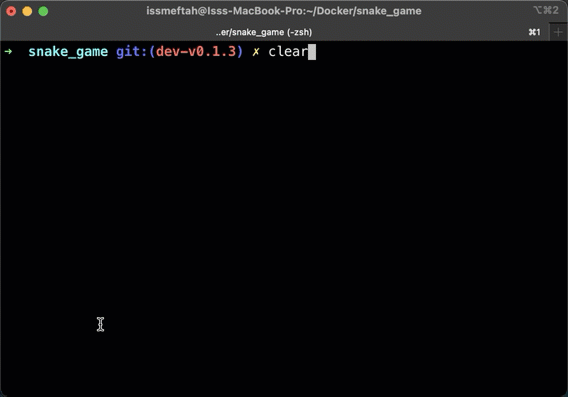

# Snake Game Implementation
Snake game implementation in Go using a 2-dimensional array.

### Demo

### Install
download the package
- `git clone https://github.com/twiny/snaky`
- `cd snaky/`

run the game directly using the Go command
- `go run cmd/launcher/main.go -x 30 -y 15 -s slow`

or build it
- `go build -o snaky -v cmd/launcher/main.go`
- `chmod +x ./snaky`

### Command usage
- `./snaky -h` print help message.
- `-x` game grid width
- `-y` game grid height
- `-s` game speed (string default: medium) - slow|medium|fast

### How to play
- `keyboard arrow key` changes Snake direction.
- `S` Key starts the game.
- `P` Key pauses the game.
- `R` restart the game.
- `ESC` or `Ctrl+C` exit the game.

## Implementation
The snake game logic:

- The snake keeps on moving in a straight line unless the direction is changed.

- If the snake ate the food it grows. then a new food will be placed on the grid. the new position must not be on the snake body nor the same as the previous one.

- If the snake bites itself or hits the wall, the game ends.

The snaky game consist of two main structures:

### 1 - `Game` struct

`Game` struct that represents the current game. it contains `Snake`, `Food` & `Board` structs

- `Board` holds the current game information:
- `Grid` is a 2d array. where snake body and food will be marked/mapped for rendering
- `Cell` is the coordinate of a point on the grid
- `Icon` used to paint the Cell when rendering board.

### 2 - `Renderer` interface

A `Renderer` is an interface that renders the game `Board`, and it consists of two methods.

- `Listen(chan Event) error`: this listens to user inputs and sends them to a channel of `Event`.
- `Render(b *Board) error`: this renders a game `Board` and prints it to the user. This way, `renderer` can be easily replaced.

The renderer range the grid Cell by Cell and depends on its value (Icon) it either print Head, Body, or Food.

## TODO
- [x] fix case food is generated on snake body.
- [x] snake auto move forward.
- [x] fix snake moving direction.
- [x] change food icon.
- [x] fix when snake hit itself or borders.
- [x] show a message to the user when the game ends/restarts.
- [x] initially the snake is stopped. disable auto-start.
- [ ] add more test cases.
